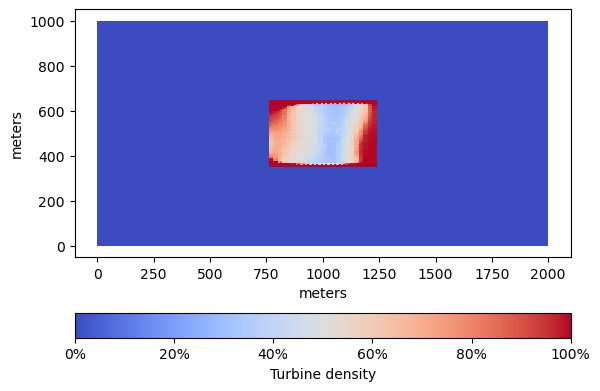

# Risk-neutral design optimization of tidal-stream energy farms

Motivated by ["Uncertain bottom friction and viscosity: A case study"](../nominal#uncertain-bottom-friction-and-viscosity-a-case-study),
we consider the risk-neutral desgin of tidal-streem energy farms 

$$
	\min_{u \in U_{\text{ad}}}  \mathbb{E}[J(S(u,\xi)),u)] + \beta \\|u\\|_{L^1(D)},
$$

where $J$, $\beta$, $S(u,\xi)$ are as described in ["Optimization problem"](../nominal#optimization-problem), but the notation $S(u,\xi)$
instead of $S(u)$ hightlightes dependence on the simulation output on parameters $\xi$, such as bottom friction. Solutions to the risk-neutral optimization problem perform best on average
with the average computed over the parameter values $\xi$. Using samples or data $\xi^1, \ldots, \xi^N$ of the parameter values, we approximate the risk-neutral problem using
the [sample average approximation (SAA)](https://doi.org/10.1137/S1052623499363220). We obtain the SAA problem

$$
	\min_{u \in U_{\text{ad}}}  \frac{1}{N} \sum_{i=1}^N J(S(u,\xi^i)),u) + \beta \\|u\\|_{L^1(D)}.
$$

## Bottom friction as a random field

## Simulation output

We compare a solution to the [nominal tidal-stream energy farms optimization problem](../nominal) with a solution to the SAA
problem where $\xi$ is a random field modelling uncertain, spatially varying bottom friction.

|:--:| 
*Nominal optimal turbine density (with fixed bottom friction)*

|:--:| 
*Risk-neutral optimal turbine density (with uncertain bottom friction)*

